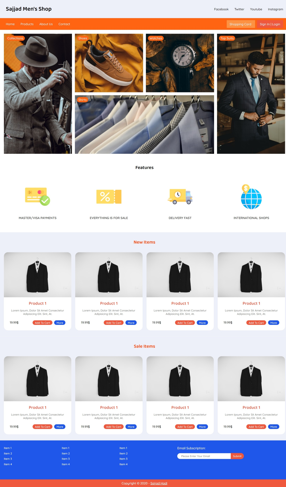

# Sajjad Men's Shop

## Overview
A web-based storefront for men's fashion items using HTML, CSS, SASS, and CSS Grid.



## Technologies
- **HTML**: Structure
- **CSS**: Styling
- **SASS**: CSS preprocessor
- **CSS Grid**: Layout

## Usage
1. Clone the repository:
   ```bash
   git clone https://github.com/yourusername/sajjad-mens-shop.git
   ```
2. Navigate to the project directory:
   ```bash
   cd sajjad-mens-shop
   ```
3. Compile SASS to CSS:
   ```bash
   npm run sass
   ```
4. Open `index.html` in your web browser.